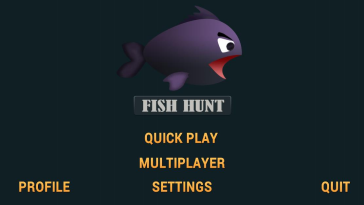
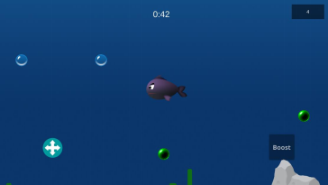
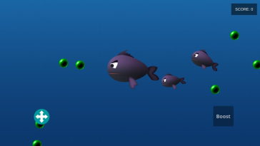
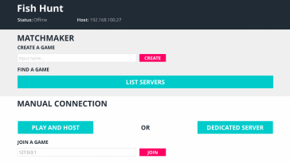
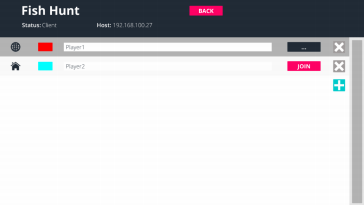
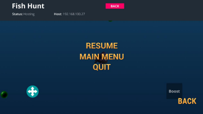

# FishHunt
“Fish Hunt” is a multiplayer android game. Each player plays as a fish and roams through the ocean within certain boundary. Every fish can eat food distributed randomly across the ocean. They grow bigger in size after eating food or other smaller fishes.  Fish with the biggest size after certain time will be considered as the winner. 

# Contribution Guide
Fork this project and, pick up an issue, notify us by commenting on the issue, and make a pull request with appropriate descriptions.

Also, if you have installed this game and found any bug, then you can make an issue directly in this github repository.

You can build and install the game using unity game engine and android or iOS SDK. The root folder for game is `/FishHunt` The `/Assets` folder contains all the assets used for the game. These assets were developed using photoshop and some of the `.psd` files are also there which can be edited to create further assets.

# Game scenes
When you open the game then you will see the start menu after the splash screen. Then you can play as singleplayer directly or play in multiplayer mode. In multiplayer option you have a choice host a game or join the game hosted in some else's device. Multiplayer players can join to the game using localhost(local multiplayer mode) or using unity's host(using internet). Some of the screenshots of the game scene are as follows:

### Start Menu

### Single Player Scene

### Multiplayer Scene

### Multiplayer Menu

### Multiplayer Lobby

### Pause Menu

